# Secure API Gateway with JWT Validation

## 📌 Project Summary

The **Secure API Gateway** project is designed to enforce robust **authentication**, **authorization**, **rate limiting**, and **secure traffic forwarding** for your microservices architecture. It provides a single entry point to your backend APIs with multiple security layers.


## 🎯 Objective

Build a secure API gateway to:
- ✅ Validate JWTs with **role-based access control**.
- ✅ Apply **IP throttling** using **Redis**.
- ✅ Log **requests & responses** with timestamps for auditing.
- ✅ Offload TLS and enforce **HTTPS** (self-signed certificate).
- ✅ Detect abuse and send alerts.
- ✅ Provide a **dashboard** for monitoring API usage and system health.


## 🛠️ Tech Stack

- **Backend:** Node.js (Express)
- **Frontend:** React.js (MUI)
- **Security:** JWT, OAuth2 (extension, optional)
- **Rate Limiting:** Redis
- **Web Server:** Linux, SystemD, Nginx (for TLS offloading)
- **Monitoring:** Dashboard with logs & alert system


## 📌 Features

- **🔑 JWT Validation:** Role-based access for users, admins, or services.
- **🚦 Rate Limiting:** Block excessive requests from abusive IPs.
- **📜 Logging:** Persistent request & response logs with timestamps.
- **🔒 HTTPS/TLS:** Self-signed certificate configuration with Nginx.
- **📊 Dashboard:** Real-time metrics, logs, and usage stats.
- **⚠️ Alerts:** Abuse detection with automatic alerts.


## 🧩 Architecture Diagram

> 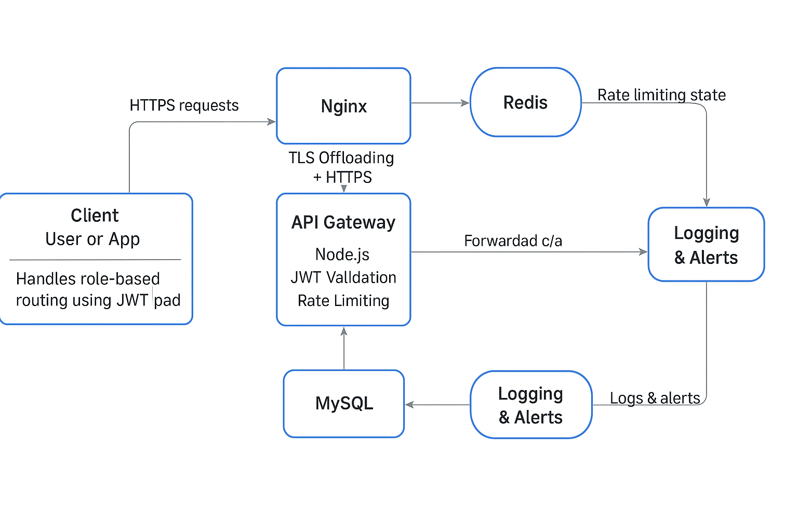  


## 🚀 Project Structure

```plaintext
secure-api-gateway/
├── backend/
│   ├── auth/
│   ├── config/
│   ├── controllers/
│   ├── logs/
│   ├── node_modules/
│   ├── routes/
│   ├── scripts/
│   ├── .env
│   ├── index.js
│   ├── package.json
│   ├── package-lock.json
│   ├── redis.js
│
├── frontend/
│   ├── build/
│   ├── node_modules/
│   ├── public/
│   ├── src/
│   ├── .gitignore
│   ├── 3000
│   ├── package.json
│   ├── package-lock.json
│   ├── README.md
│
├── Nginx/
│   ├── default-site.config
│   ├── nginx.config
|   ├── ssl/

```

---

## ⚙️ Installation & Setup

---

### 1️⃣ Clone the Repository

```bash
git clone https://github.com/<your-username>/secure-api-gateway.git
cd secure-api-gateway
```


### 2️⃣ Install Backend Dependencies

```bash
cd backend
npm install
```


### 3️⃣ Install Frontend Dependencies

```bash
cd ../frontend
npm install
```


### 4️⃣ Install Redis

# Ubuntu example
```bash
sudo apt update
sudo apt install redis-server
```

# Enable & start Redis
```bash
sudo systemctl enable redis-server
sudo systemctl start redis-server
```


### 5️⃣ Install MySQL

# Ubuntu example
```bash
sudo apt update
sudo apt install mysql-server
```
# Enable & start MySQL
```bash
sudo systemctl enable mysql
sudo systemctl start mysql
```

Create your database and user in MySQL:

```sql
CREATE DATABASE secure_gateway;
CREATE USER 'root'@'localhost' IDENTIFIED BY 'yourpassword';
GRANT ALL PRIVILEGES ON secure_gateway.* TO 'root'@'localhost';
FLUSH PRIVILEGES;
```


### 6️⃣ Install PM2 (Optional but Recommended)

> PM2 is a process manager for Node.js — it keeps your app alive & restarts it on crashes.

```bash
sudo npm install -g pm2
```
# Start your backend with PM2
```bash
cd backend
pm2 start index.js --name secure-api-gateway
```
# Optional: save & startup script
```bash
pm2 save
pm2 startup
```


### 7️⃣ Install & Setup Nginx

```bash
sudo apt update
sudo apt install nginx
```
# Enable & start Nginx
```bash
sudo systemctl enable nginx
sudo systemctl start nginx
```


### 8️⃣ Configure Environment Variables

Create a `.env` file in your `/backend` folder and add:

```env
PORT=3000
JWT_SECRET=your-secret-key
REDIS_HOST=localhost
REDIS_PORT=6379
MYSQL_HOST=localhost
MYSQL_USER=root
MYSQL_PASSWORD=yourpassword
MYSQL_DATABASE=secure_gateway
```


### 9️⃣ Generate Self-Signed TLS Certificate

Inside your `/etc/nginx/ssl/` folder, run:

```bash
openssl req -x509 -nodes -days 365 \
  -newkey rsa:2048 \
  -keyout Nginx/ssl/server.key \
  -out Nginx/ssl/server.crt
```


### 🔟 Setup & Configure Nginx

Your **Secure API Gateway** uses **Nginx** for:
- TLS/SSL offloading (HTTPS)
- Proxying API requests to Node.js backend
- Serving React frontend (optional)


#### 📁 Nginx Config Files

- Main config: `/etc/nginx/nginx.conf`  
- Site config: `/etc/nginx/sites-available/default`  
  (or `/etc/nginx/conf.d/secure-gateway.conf`)


#### 📝 Example `nginx.conf`

```nginx
user www-data;
worker_processes auto;
pid /run/nginx.pid;

events {
  worker_connections 1024;
}

http {
  include       /etc/nginx/mime.types;
  default_type  application/octet-stream;

  sendfile        on;
  keepalive_timeout 65;

  server {
    listen 80;
    listen [::]:80;
    server_name your-domain.com;

    # Redirect HTTP to HTTPS
    return 301 https://$host$request_uri;
  }

  server {
    listen 443 ssl;
    listen [::]:443 ssl;
    server_name your-domain.com;

    ssl_certificate /etc/nginx/ssl/server.crt;
    ssl_certificate_key /etc/nginx/ssl/server.key;

    ssl_protocols TLSv1.2 TLSv1.3;

    location /api/ {
      proxy_pass http://127.0.0.1:8080/;
      proxy_set_header Host $host;
      proxy_set_header X-Real-IP $remote_addr;
      proxy_set_header X-Forwarded-For $proxy_add_x_forwarded_for;
      proxy_set_header X-Forwarded-Proto $scheme;
    }

    location / {
      root /var/www/html; # or your frontend build folder
      try_files $uri /index.html;
    }
  }
}
```


#### ✅ Test & Reload Nginx

Test your config:

Start Nginx
```bash
sudo systemctl start nginx
```

Check Status
```bash
sudo nginx -t
```

Reload or restart:

```bash
sudo systemctl reload nginx
```
# or
```bash
sudo systemctl restart nginx
```


✅ **Done!** Now your Secure API Gateway runs behind HTTPS with:
- Node.js + PM2
- Redis
- MySQL
- Nginx (TLS + proxy)

You’re production-ready! 🚀

---

### ⚠️ Note for External Database & Redis

If you use **external servers** for **MySQL** or **Redis** (like AWS RDS, AWS Elasticache, or any managed service):

- Replace `localhost` with the **hostname or IP** of your external MySQL/Redis server in your `.env`:
```env
  MYSQL_HOST=your-external-mysql-host
  REDIS_HOST=your-external-redis-host
```

---

## 📈 How It Works (Rate Limmiter and Logs)

---

### 🚦 IP Rate Limiting

Your API Gateway uses **Redis** to:
- Count requests from each unique IP.
- Block IPs that exceed your defined limit (e.g., 100 requests per minute).
- Return `429 Too Many Requests` if the limit is hit.

**✅ How it works:**  
- The middleware checks the Redis store for the IP count.
- If under limit, request is allowed.
- If over limit, request is blocked and an **alert log** is created.


### 📜 Request & Response Logging

Every request & response is logged for **traceability** and **security auditing**.

**✅ Where logs are stored:**

```plaintext
backend/logs/
├── request-YYYY-MM-DD.log
├── response-YYYY-MM-DD.log
├── alert-YYYY-MM-DD.log
```

- **Request logs** include method, URL, IP, timestamp.
- **Response logs** include status codes, results.
- **Alert logs** record rate limit abuse or suspicious activity.


### ⚠️ Alert System

If the Rate Limiter blocks an IP for too many requests:
- An **alert entry** is written to `alert-*.log`.
- The **Admin Dashboard** displays active alerts.
- Admin can monitor IPs.

✅ **This makes your Gateway resilient to abuse and helps detect suspicious patterns.**


### 📊 Dashboard Monitoring

Your Dashboard shows:
- Total requests per minute.
- Rate limit status.
- Alerts triggered by suspicious IPs.

---

## 🚀 Usage Guide

---

### 👥 User Roles & Permissions

Your Secure API Gateway supports **3 types of users**:

1️⃣ **Admin**
- Can see request logs & alert logs
- Full access to the Admin Dashboard
- Can approve/unapprove blogs
- Can edit or delete any user

- > 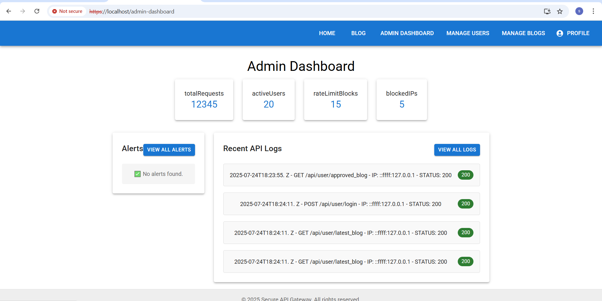
- >  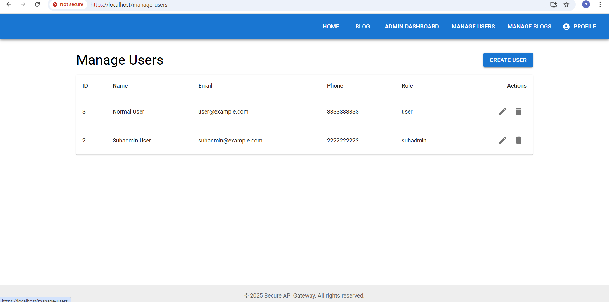
- > 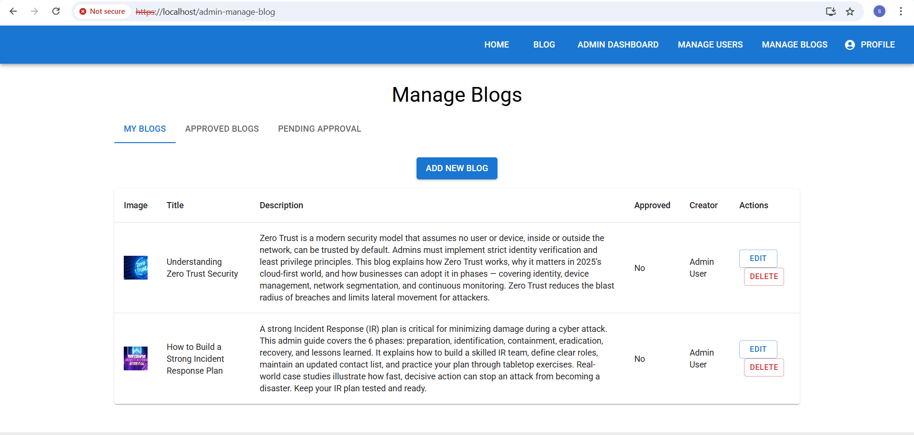
- > 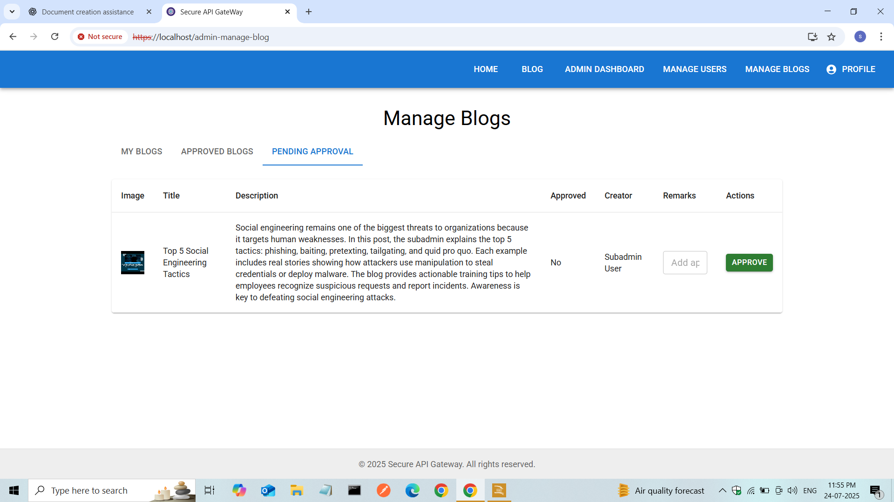


2️⃣ **Subadmin**
- Same as Admin but **cannot approve/unapprove blogs**
- Can manage user edits/deletes
- Can see logs & alerts

- > 
- >  
- > 

3️⃣ **User**
- Can create new blogs
- Can edit their own profile
- Cannot access logs or other users

  > 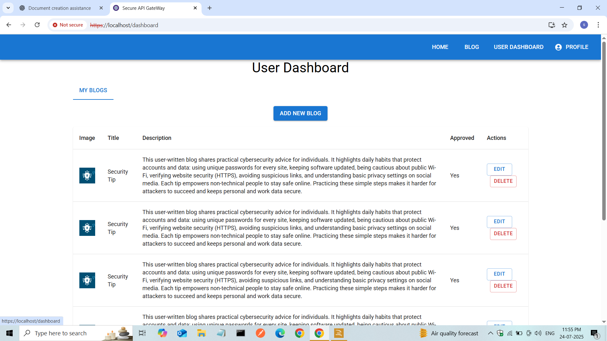
  

✅ The **JWT** contains a `role` claim:
- The **API Gateway** checks the role for protected routes.
- The **Frontend** uses the role to show/hide pages (Admin panel, blog approval, etc).


### 🗂️ Default Test Users

Your project includes **3 default users** for quick testing:

| Role      | Email                 | Password         |
|-----------|-----------------------|------------------|
| Admin     | admin@example.com     | admin@1234       |
| Subadmin  | subadmin@example.com  | subadmin@1234    |
| User      | user@example.com      | user@1234        |

Use these accounts to **log in** and get valid JWTs for each role.


### Example JWT Payload

```json
{
  "id": "123",
  "email": "admin@gmail.com",
  "role": "admin",
  "exp": 1698754400
}
```

### How Roles Control Routes

- **Admin & Subadmin** can access:
  - `.../admin/*` routes
  - Dashboard for logs & alerts
- **Users** can only access:
  - `.../blogs` (create blogs)
  - `.../profile` (edit profile)

✅ Any other access returns **403 Forbidden** if the role check fails.


### 🔑 How Roles Work in Backend

- Every **protected API route** uses **middleware** to:
  - Verify the **JWT signature**
  - Decode the token to read the `role` field
  - Allow or deny access based on allowed roles

**Example:**

```js
// Example middleware
const jwt = require('jsonwebtoken');
const asyncHandler = require('express-async-handler');
require('dotenv').config();

const authMiddleware = (allowedRoles = []) =>
    asyncHandler(async (req, res, next) => {
        let token;

        try {
            const authHeader = req.headers.authorization || '';

            console.log('[AuthMiddleware] Header:', authHeader);

            if (authHeader.startsWith('Bearer ')) {
                token = authHeader.split(' ')[1];

                if (!token) {
                    return res.status(401).json({ error: 'Unauthorized: Token missing' });
                }

                // Verify token
                const decoded = jwt.verify(token, process.env.JWT_SECRET);

                // Attach user to request
                req.user = decoded;

                console.log('[AuthMiddleware] Decoded user:', decoded);

                // If roles were passed → check if user's role is allowed
                if (allowedRoles.length > 0 && !allowedRoles.includes(decoded.role)) {
                    return res.status(403).json({ error: 'Forbidden: Role not permitted' });
                }

                return next();
            }

            // If no Bearer header
            return res.status(401).json({ error: 'Unauthorized: No token provided' });

        } catch (error) {
            console.error('[AuthMiddleware] Error:', error.message);
            return res.status(401).json({ error: `Unauthorized: ${error.message}` });
        }
    });

module.exports = authMiddleware;

```

✅ Use `checkRole('admin')`, `checkRole('subadmin')`, etc., for each **API route**.


### How Frontend Uses Role

In your React app:

```js
import {jwt_decode} from "jwt-decode";

const token = localStorage.getItem("token");
if (token) {
  const decoded = jwt_decode(token);
  const role = decoded.role;

  if (role === "admin") {
    // Show Admin Panel
  } else if (role === "subadmin") {
    // Show Subadmin tools
  } else {
    // Regular User pages
  }
}
```

### All Related Images 

Home Page
- > 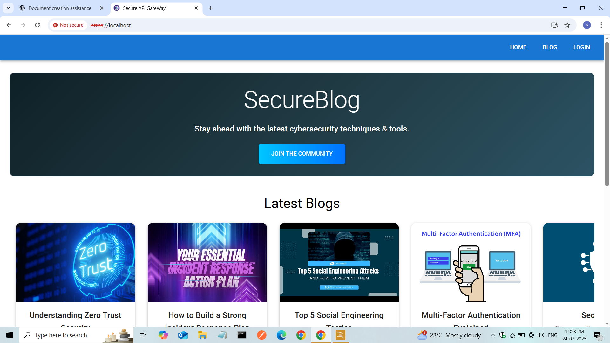

Blog Page

- > 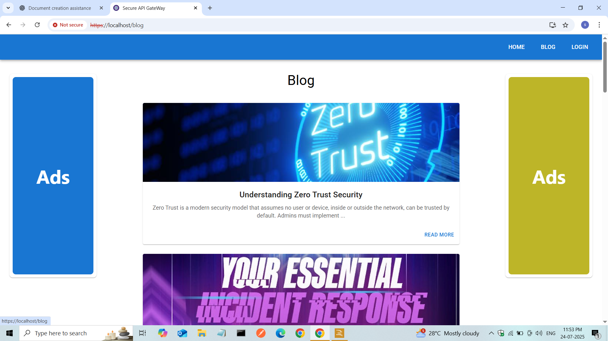

Login Page

- > 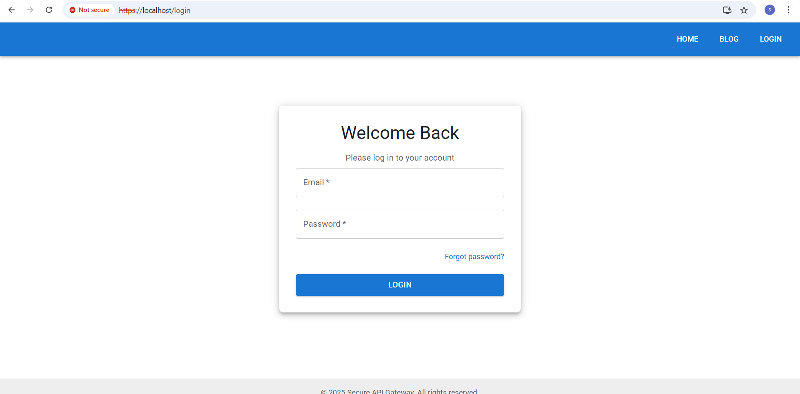

Forgot Password

- > 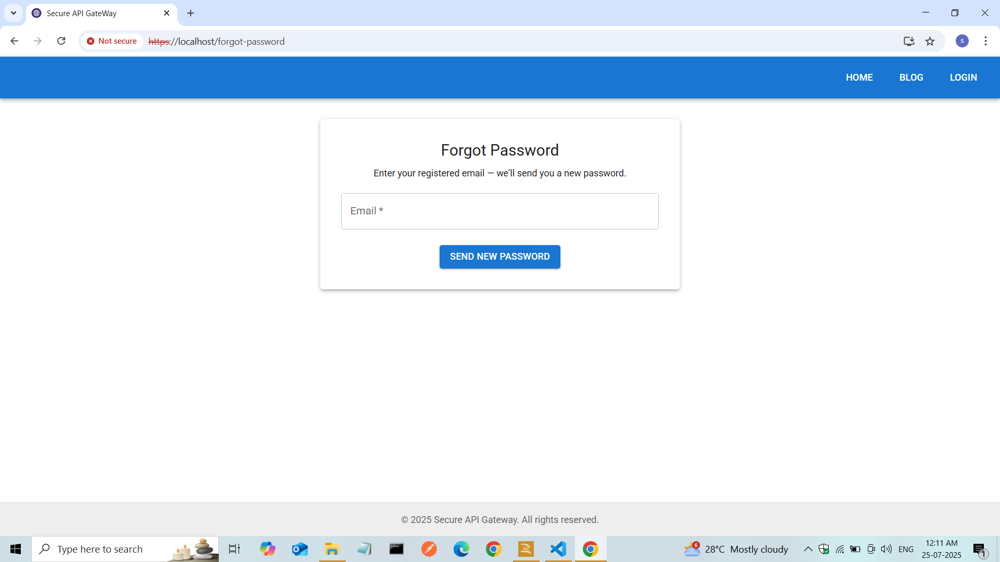

Admin Dashboard

- > 

Manage User

- > 

Admin Manage Blog

- > 

Admin Approve Blog

- > 

Sub Admin Blog 

- > 

User Dashboard

- > 

Edit Profile

- > 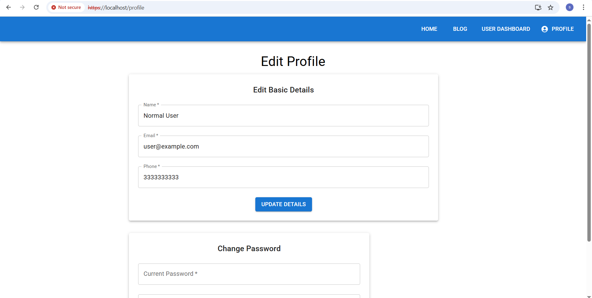


---

## 📬 License & Contact

---

### 📄 License

This project is licensed under the **MIT License** — feel free to fork, adapt, and build on it.

---

### 📧 Contact

If you find bugs, have suggestions, or want to contribute:
- Open an **Issue** on this repository.
- Or email me at **sag197348@gmail.com**.

---

✅ Built with ❤️ by Sagar Kumar — Secure APIs, done right!

---

